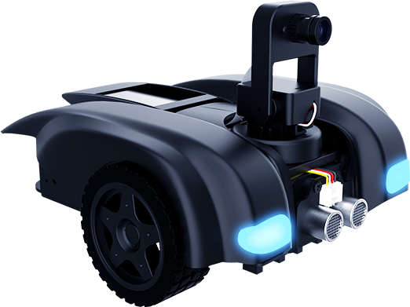

<br />

<br />


<div class="title_pic">
    
    
</div>

<br />

<a href="https://travis-ci.org/sipeed/MaixPy">
    
</a>
<a href="http://dl.sipeed.com/MAIX/MaixPy/release/master/">
    
</a>
<a href="https://github.com/sipeed/MaixPy/releases">
    
</a>
<a href="https://github.com/sipeed/MaixPy/blob/master/LICENSE.md">
    
</a>

<br />

[中文](README_ZH.md)

<br />

**TinkerGen**

**M.A.R.K. A Robot for AI Education**

Make A Robot Kit, also known as “M.A.R.K.” is a versatile intelligent car designed for learning about Artificial Intelligence. Using the AI controller which comes with MARK, a child can implement track identification, traffic sign identification, and other AI features to put together a self-driving car. MARK is built around Kendryte a very powerful embedded AIOT chip [K210](https://kendryte.com) and running a [Micropython](http://www.micropython.org) firmware developed jointly by TinkerGen and Sipeed Maixpy.

This repository contains TinkerGen version of MARK Micropython firmware. The Micropython code can be found in [this repository](https://github.com/TinkerGen/Mark-micropython). If you're not sure what you're looking for, think of firmware as an "OS"(like Windows/Linux/Mac OS), which is responsible for low-level hardware control and Micropython code as "programs"(similiar to Office/browser/etc).

> K210 brief: 
> * Image Recognition with hardware acceleration
> * Dual core with FPU
> * 8MB(6MB+2MB) RAM
> * 16MB external Flash
> * Max 800MHz CPU freq (see the dev board in detail)
> * Microphone array(8 mics)
> * Hardware AES SHA256
> * FPIOA (Periphrals can map to any pins)
> * Peripherals: I2C, SPI, I2S, WDT, TIMER, RTC, UART, GPIO etc.

## Documentation

For information about how to use MARK with Codecraft, go to [MARK webpage](https://www.tinkergen.com/mark).

MaixPy documentation refer to [maixpy.sipeed.com](https://maixpy.sipeed.com)

## Examples

[MaixPy_scripts](https://github.com/sipeed/MaixPy_scripts)

## Build From Source

This repository contains Micropython code that is running on top of compiled firmware. For information about how to build and customize firmware, please see [build doc](https://github.com/TinkerGen/MARK_firmware/blob/cybereye/build.md).

## License

See [LICENSE](LICENSE.md) file


## Other: As C SDK for C developers


In addition to the source code of the `MaixPy` project, since `MaixPy` exists as a component, it can be configured to not participate in compilation, so this repository can also be developed as `C SDK`. For the usage details, see [Building Documentation](build.md), which can be started by compiling and downloading `projects/hello_world`.

The compilation process is briefly as follows:

```
wget http://dl.cdn.sipeed.com/kendryte-toolchain-ubuntu-amd64-8.2.0-20190409.tar.xz
sudo tar -Jxvf kendryte-toolchain-ubuntu-amd64-8.2.0-20190409.tar.xz -C /opt
cd projects/hello_world
python3 project.py menuconfig
python3 project.py build
python3 project.py flash -B dan -b 1500000 -p /dev/ttyUSB0 -t
```


